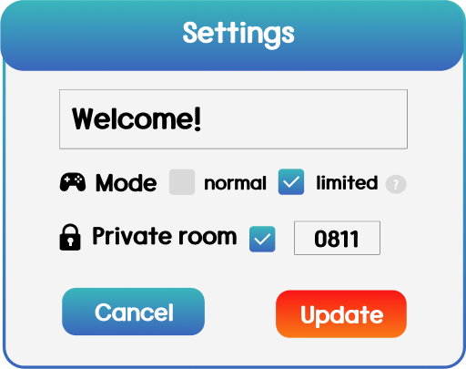

# Rock-Paper-Scissors Brawl

**Play**: https://rpsbrawl.dantae.net  
**Source code**: https://github.com/salt26/rpsbrawl

**[한글 설명 보기](./README_Kor.md)**

---

## Introduction
A network rock-paper-scissors game enjoyed by dozens of people simultaneously.  
Enjoy Rock-Paper-Scissors Brawl with your friends!  
**6-15 people are the best!** 👍  
Up to 30 people can play in a room!  
**Solo play is also available with bots.** 🤖  
One round is over in a minute! ⏱️

#### When should I play RPS Brawl?
* When you need a game that can **award individual scores** in recreation
* When there are **too many friends** and there is no suitable game for everyone to **enjoy together**
* When you want to have a **serious match** with your friend
* When you want to test your own **alacrity**

  
  
  
  
  
  

## Rule
**"Win the hand of the last person to play!"**

Whenever someone throws a hand, it will be displayed in the center of the screen.  
If you win the hand, you will get +1 points.  
But if you lose the hand, you will get -1 points.  
You can throw your hand repeatedly every second.  
Get the most points in 60 seconds! 🤩

*If you had planned to play rock because the screen displayed scissors, but the moment you played rock, scissors turned into paper, then what would you do~?* 😜

## How to play
1. **https://rpsbrawl.dantae.net**
   * You can play this on your PC or smartphone.
   * No installation required.
2. Set your **language** and turn on the **music**. 🎵
   * You can change the language. Both English and Korean are available.
   * Play RPS Brawl with fluttering background music!  
   

   * You can see the manual in the upper right corner of the screen.  
   
3. Join with your own unique **nickname**.
   * Please don't disclose sensitive information.  
   
4. **Create** a new room or **join** the existing room.
   * If there are available public waiting rooms, you can quickly join one at random by clicking on 'Quick Start'.
   * You need a password to enter a private room.
   * You cannot enter the room where the game started.  
   
5. **Set up** your room if you are a host.
   * Only the room host can set the room name, mode and password(optional).  
   

   * In **normal** mode, you can throw any hands. This is recommended for beginners.
   * In **limited** mode, you cannot throw the same hand in a row. This is recommended for skilled players.  
   
6. Set your **team**.
   * Anyone can change their team.
7. Add as many **bots** as you want.
   * Only the room host can add bots. 
   * A **skilled** bot  only throws the winning hand. It is quick to react.
   * A **dumb** bot  only throws the losing hand. It is slow to react.
   * The game is more fun when two types of bots are mixed!
   * **Adding bots is necessary for solo play.**
     * If you are a beginner, it is suggested to try adding 2 skilled bots and 2 dumb bots.
     * If you feel confident in your skills, you have the option to add up to 10 skilled bots and 10 dumb bots to the game. It will never be easy. 😎  
   
8. **Start** the game and enjoy RPS Brawl!
   * Only the room host can start the game.  
   
   
   * If you are a beginner, see the [Rule section](#rule).
   * Sometimes you might be disconnected. **If the screen is frozen, press F5 and join again with the same nickname.**
     * This feature enables you to reconnect to an ongoing game. (if exists)
9. When the game is over, you will see a **result** page.
   * After 20 seconds, you will be automatically transferred to your room.
     * So, all you have to do is wait. 😄
   * You can save the results of the game as a file.
   * You may capture the screen and show off to your friends!
10. If you find a bug, feel free to report it [here](https://github.com/salt26/rpsbrawl/issues).