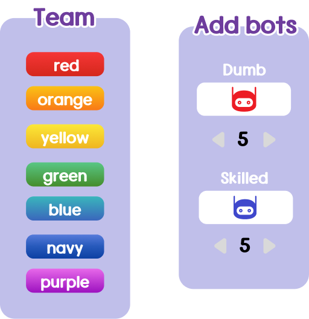

# 가위바위보 난투

**플레이**: https://rpsbrawl.dantae.net  
**소스 코드**: https://github.com/salt26/rpsbrawl

**[Read English documentation](./README.md)**

---

## 소개
수십 명의 사람들과 즐기는 네트워크 가위바위보 게임!  
친구들을 모아 가위바위보 난투를 즐겨보세요!  
**추천 인원 6 ~ 15명!** 👍  
최대 30명까지 플레이 가능!  
**혼자서도 봇과 함께 재미있게!** 🤖  
1분이면 한 판 끝! ⏱️

#### 언제 가위바위보 난투를 하면 좋을까요?
* 레크리에이션에서 **개인 점수를 부여**할 수 있는 게임이 필요할 때
* **친구들이 너무 많아** 다같이 즐길 수 있는 마땅한 게임이 없을 때
* 친구와 **진지하게 한 판** 붙고 싶을 때
* 본인의 **순발력**을 시험해보고 싶을 때

  
  
  
  
  
  

## 규칙
**"마지막에 낸 사람의 손을 이겨라!"**

누군가 손을 낼 때마다 해당 손이 화면 중앙에 표시됩니다.  
이 손을 이기면 +1점! 지면 -1점!  
손은 1초마다 반복하여 낼 수 있습니다.  
60초 안에 가장 많은 점수를 획득하세요! 🤩

*가위가 있길래 바위를 내려고 했는데, 내는 순간 가위가 보로 바뀌어버린다면~?* 😜

## 플레이 방법
1. **https://rpsbrawl.dantae.net**
   * PC 또는 스마트폰에서도 즐길 수 있습니다!
   * 프로그램을 설치하지 않아도 됩니다.
2. 접속하기 전에 먼저 **언어**를 설정하고 **음악**을 켜세요. 🎵
   * 화면 왼쪽 위에서 언어를 ENG에서 KOR로 바꾸세요!
   * 설레는 배경음악을 들으면서 가위바위보 난투를 즐겨보세요!  
   
   * 화면 오른쪽 위에서 도움말을 볼 수 있습니다.  
   
3. 개성 있는 **닉네임**을 입력하고 난투에 뛰어드세요!
   * 민감한 정보는 공개하지 마세요.  
   
4. 새 방을 **만들거나**, 기존 방에 **입장**하세요.
   * 공개 대기 방이 있다면 '빠른 시작'을 눌러 그 중 무작위 방 하나에 바로 입장할 수 있습니다.  
   * 비밀 방에 입장할 때에는 비밀번호가 필요해요.
   * 게임이 시작된 방에는 입장할 수 없습니다.  
   
5. 방장이라면 방을 **설정**하세요.
   * 방장만이 방 이름, 모드, 그리고 비밀번호(선택)를 설정할 수 있습니다.  
   
   * **일반** 모드에서는 마음껏 아무 손이나 낼 수 있습니다. 초보자에게 추천하는 모드입니다.
   * **한 손 제한** 모드에서는 연속으로 같은 손을 낼 수 없습니다. 숙련된 플레이어에게 추천하는 모드입니다.  
   
6. **팀**을 설정하세요.
   * 누구나 자신의 팀을 바꿀 수 있습니다.
7. 봇을 넣고 싶은 만큼 넣어보세요.
   * 방장만이 봇을 추가할 수 있습니다. 
   * **숙련봇**  은 이기는 손만 내는 봇입니다. 반응 속도도 빠르죠.
   * **트롤봇**  은 지는 손만 내는 봇입니다. 반응 속도는 느린 편입니다.
   * 두 종류의 봇을 섞으면 게임이 훨씬 재미있습니다!
   * **혼자 플레이할 때에는 꼭 봇을 추가해주세요!**
     * 가위바위보 난투가 처음이라면 숙련봇 2기와 트롤봇 2기를 넣고 플레이해보세요.
     * 가위바위보 난투에 자신이 있다면 숙련봇 10기와 트롤봇 10기를 넣고 고득점에 도전해보세요! 절대 쉽지 않을 겁니다! 😎  
   
8. 게임을 **시작**하고 가위바위보 난투를 즐기세요!
   * 방장만이 게임을 시작할 수 있습니다.  
   
   * 처음 해보는 분은 [규칙 섹션](#규칙)을 읽어보세요.
   * 가끔 연결이 끊기기도 합니다. **만약 화면이 멈춘다면, F5를 누르고 같은 닉네임으로 다시 입장해주세요.**
     * 게임이 진행 중이라면 재접속할 수 있습니다!
9. 게임이 끝나면 **결과** 화면을 보게 됩니다.
   * 20초가 지나면 자동으로 방으로 이동됩니다.
     * 그러니 가만히 기다려주시면 되겠습니다. 😄
   * 게임 결과를 파일로 저장할 수 있습니다.
   * 화면을 캡처해서 친구들에게 자랑할 수도 있겠죠!
10. 버그를 발견한다면 [여기](https://github.com/salt26/rpsbrawl/issues)에 제보해주세요.